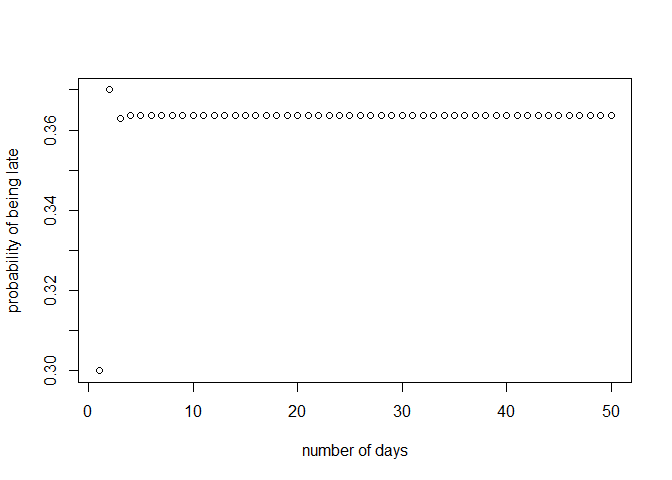
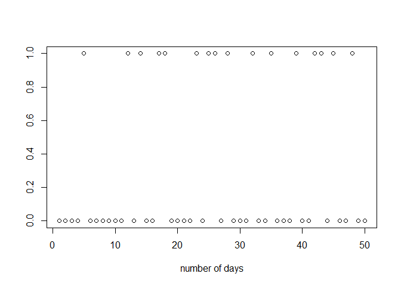

An introductory example
=======================

Assume a student has lectures every day at the University of Toronto and
is either punctual or late. The student is late with probability 0.3,
when he was late the day before, and late with probability 0.4, when he
was punctual the day before. Being late or punctual two days before does
not influence his punctuality.

1. Defining the Markov Chain
----------------------------

-   state space: *S* = {*l*, *p*}, *l* means late, *p* means punctual  

-   {*X*<sub>*n*</sub>, *n* = 0, 1, …}, where the event
    {*X*<sub>*n*</sub> = *l*} means that the student is late at day
    *n*.  

-   fulfills the Markov property since the event that the student is
    late or punctual only depends whether the student was late or
    punctual the day before. It holds for *n* ≥ 0

-   transition matrix
    $P = \\begin{pmatrix}  p\_{l,l} & p\_{l,p}\\\\  p\_{p,l} & p\_{p,p}  \\end{pmatrix}  = \\begin{pmatrix}  0.3 & 0.7\\\\  0.4 & 0.6  \\end{pmatrix}$.

**Numerical implementation: R code**

``` r
# initialise the transition matirx
P <-  matrix(c(0.3, 0.4, 0.7, 0.6), nrow = 2)
rownames(P) <- c("l","p")
colnames(P) <- c("l","p")
# note / check that all rows sum up to 1
P
```

    ##     l   p
    ## l 0.3 0.7
    ## p 0.4 0.6

``` r
rowSums(P)
```

    ## l p 
    ## 1 1

2. Transition probabilities and stationary distribution
-------------------------------------------------------

**Question:** What are the transition probabilities that the student is
late or punctual after two days?

**Question:** How about after the 10<sup>*t**h*</sup> day?

**Question:** How about after the 50<sup>*t**h*</sup> day?

For this, we have to calculate the transition probabilities for day 2
(*P* \* *P*), and for day 10 (*P*<sup>10</sup>) and for day 50
(*P*<sup>50</sup>).

``` r
# transition probability after 2 days
P %*% P
```

    ##      l    p
    ## l 0.37 0.63
    ## p 0.36 0.64

``` r
# note / check that all rows sum up to 1
rowSums(P)
```

    ## l p 
    ## 1 1

**Question:** What is the interpretation of 0.37?

``` r
# transition probability after 10 days
P %^% 10
```

    ##           l         p
    ## l 0.3636364 0.6363636
    ## p 0.3636364 0.6363636

``` r
# transition probability after 50 days
P %^% 50
```

    ##           l         p
    ## l 0.3636364 0.6363636
    ## p 0.3636364 0.6363636

**Question:** What do you observe?

We see numerically that the rows of the transition matrices always add
up to 1. Further, we observe that the transition matrix after 10 days
and after 50 days are numerically equal. Let *t* = 0 correspond to the
induction day and *t* = 1 to the first day of lectures. Then we have
that, if the student was late at the induction day, he will be late at
the end of the semester with probability 0.3636364, independent of
whether he was late or not during the term. Recall that
*p*<sub>*l**l*</sub><sup>50</sup> = *P*(*X*<sub>50</sub> = *l*\|*X*<sub>0</sub> = *l*)
is the probability that the student is late on the 50th day, given he
was late at the induction day. Numerically, we observe that
*p*<sub>*l**l*</sub><sup>10</sup> = *p*<sub>*l**l*</sub><sup>11</sup> = ⋯ = *p*<sub>*l**l*</sub><sup>50</sup> = ⋯*p*<sub>*l**l*</sub><sup>*n*</sup> = ⋯
for all *n* large. Thus, the probability of being late on a day later in
the semester, is independent whether the student was late at induction
day or not.

**Question:** Does this mean that (0.3636364, 0.6363636) is a stationary
distribution for the Markov Chain?

**Question:** What properties of the Markov Chain imply that the Markov
Chain has a *stationary distribution*?

**Question:** How many stationary distributions does the Markov Chain
have?

**Question:** Calculate analytically the stationary distribution.

``` r
# the analytical stationary distribtuion is
pi <- c(4/11, 7/11)
names(pi) <- c("l", "p")
# we veryfy that pi is a stationary distribtuion, that is pi * P = pi
t(pi) %*% P
```

    ##              l         p
    ## [1,] 0.3636364 0.6363636

``` r
pi
```

    ##         l         p 
    ## 0.3636364 0.6363636

``` r
all.equal(t(pi) %*% P, t(pi))
```

    ## [1] TRUE

3. Initial distribution
-----------------------

Let us look at students whose transition probabilities are described by
*P* but have different probabilities to be punctual at induction day
(*t* = 0).

-   *student 1*: probabilities at induction day (0.5, 0.5) (random
    student)
-   *student 2*: probabilities at induction day (0.2, 0.8) (good
    student)
-   *student 3*: probabilities at induction day (0.7, 0.3) (bad student)

**student 1**

``` r
# probability of student 1 at induction day  
student1_x0 <- c(0.5, 0.5)

# probability at the first day
student1_x0 %*% P
```

    ##         l    p
    ## [1,] 0.35 0.65

``` r
# probability at the 5th day
student1_x0 %*% (P %^% 5)
```

    ##             l        p
    ## [1,] 0.363635 0.636365

``` r
# probability at the 100th day
student1_x0 %*% (P %^% 100)
```

    ##              l         p
    ## [1,] 0.3636364 0.6363636

Observe that *student 1* has probability 0.5 to be punctual at induction
day. On the first day of lectures however, *student 1* has probability
0.65 to be punctual.

**student 2**  
Now let us look at the “good” *student 2* who started with probability
of 0.8 to be punctual at induction day.

``` r
# probability of student 2 at induction day  
student2_x0 <- c(0.2, 0.8)

# probability at the first day
student2_x0 %*% P
```

    ##         l    p
    ## [1,] 0.38 0.62

``` r
# probability at the 5th day
student2_x0 %*% (P %^% 5)
```

    ##             l        p
    ## [1,] 0.363638 0.636362

``` r
# probability at the 100th day
student2_x0 %*% (P %^% 100)
```

    ##              l         p
    ## [1,] 0.3636364 0.6363636

**student 3**  
How about *student 3* who only has a probability of 0.3 to turn up
punctual at induction day? Will he improve over the semester?

``` r
# probability of student 3 at induction day 
student3_x0 <- c(0.7, 0.3)

# probability at the first day
student3_x0 %*% P
```

    ##         l    p
    ## [1,] 0.33 0.67

``` r
# probability at the 5th day
student3_x0 %*% (P %^% 5)
```

    ##             l        p
    ## [1,] 0.363633 0.636367

``` r
# probability at the 100th day
student3_x0 %*% (P %^% 100)
```

    ##              l         p
    ## [1,] 0.3636364 0.6363636

We observe that at the end of the semester, *student 1* (random
student), *student 2* (good student) and *student 3* (bad student) have
the same probability (0.6363636) to come punctually to the lectures.

**Question:** Does this hold for any student, whose transition
probabilities are described by *P*? That is, does the initial
distribution of the student not influence the limiting distribution?

Numerically, and also analytically (**Why?**), it holds that for any
initial distribution *ν*, 1 − *ν*, *ν* ∈ \[0, 1\] on the state space
*S* = {*l*, *p*}.

4. Sample path
--------------

So far we only looked how the probabilities of being punctual or late
changes from day to day or over the semester. In this section we look at
sample paths of the Markov Chain. If we ask a student to note down every
single day whether he was late or punctual, he will provide us with an
(infinite) sequence consisting of *l*’s and *p*’s – his sample path.

**Simulating a sample path:**

1.  Set an initial value for *x*<sub>0</sub>. (Is the student punctual
    or late at induction day?) To be able to use the matrix notation,
    the initial value needs to be a vector. For example
    *x*<sub>0</sub> = (1, 0) means the student is late at induction
    day.  
2.  for *n* ≥ 1 do:
    1.  calculate *x*<sub>0</sub> \* *P*<sup>*n*</sup> (the distribution
        of the student to be late/punctual on the *n*<sup>*t**h*</sup>
        day)  
    2.  generate a realisation from a random variable with distribution
        *x*<sub>0</sub> \* *P*<sup>*n*</sup>  
    3.  set the outcome of the random variable equal to
        *x*<sub>*n*</sub>

The collection *x*<sub>0</sub>, *x*<sub>1</sub>, … is the sample path of
the student.

**A simulated sample path: R code**  
For simplicity, denote *l* = 1 and *p* = 0. Choose
*x*<sub>0</sub> = (1, 0), that is the student is late on the first day.

``` r
# set the seed for generating random variables (for reproducability) 
# set.seed(2019)
# number of days (length of simulated sample path)
n <- 50
# initialise the sample path
sample_path <- rep(0, lenthought = n)
# initialise the probability that the student is late
late <- rep(0, lenthought = n)

# initial value at induction day
x0 = c(1, 0)
# probability that the student is late on the first day
late[1] <- (x0 %*% P)[1]

for(i in 2:n){
  # probability that the student is late at day n
  late[i] <- (x0 %*% (P %^% i))[1]
  # genearte a Bernoulli random variable with probability = late
  sample_path[i] <- rbinom(1, 1, late[i])
}
```

The first plot shows the probability that the student is late over the
next 50 days. The second plot shows the generated sample path, that
displays whether the student is late (1) or punctual (0) for the next 50
day.



**Question** If you rerun the above code to simulate a sample path, you
should always get something different. Have a close look at the figure
to the right. The figure on the left will always look very similar. Why?

**Question** Rerun the above code to simulate a sample path changing
*n*, the length of the sample path, and/or the initial value.

**Question** You can also rerun the whole document using different
transition probabilities. (However, the text might be sometimes
inconsistent…)
